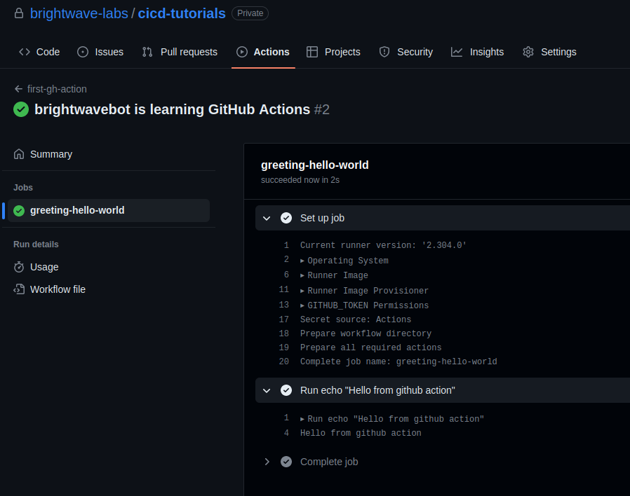

# GitHub actions

## What is a github action?

Automate your workflow from idea to production. GitHub Actions is a continuous
integration and continuous delivery (CI/CD) platform that allows you to automate
your build, test, and deployment pipeline. You can create workflows that build
and test every pull request to your repository, or deploy merged pull requests
to production.

## Features of github actions

1. Live logs with emojis and color output.
2. Builtin secret store.
3. Multi container testing.

## Where to store github actions?

GitHub actions are usually stored as a YAML file in `.github/workflows`
directory.

## Components of github acttions

1. Events - It triggers the workflow when any activity happens in a repository,
for example, opening of Pull Request, merging of branch. The complete list of
[Events that trigger workflows](https://docs.github.com/en/actions/using-workflows/events-that-trigger-workflows).
2. Workflows - A repository can have multiple workflows and defined in `.github/workflows`
directory. It is a configurable automated process that will run one or more jobs.
3. Runners - It is a server, where the actual job runs.
4. Jobs - A set of steps that will be executed on runner.
5. Steps - Actions to perform.

## Writing your first github action or the workflow

Create a file named `helloworld.yaml` in the `.github/workflows` directory. The
same file can be located [here](../../.github/workflows/helloworld.yaml).

```yaml
## Our first github action

## Name of the action
name: first-gh-action

## Name for the workflow
run-name: ${{ github.actor }} is learning GitHub Actions

## On what events, this workflow should run
on: [push]

## List the jobs
jobs:
## Name of the job
  greeting-hello-world:
    ## information about the runner to run the job
    runs-on: ubuntu-latest
    ## List of steps to perform
    steps:
      - run: echo "Hello from github action"
```

## Commit and push the code to run the action

Once you commit and push the changes, it will run the action and gives you
detailed explanation. The details can be found [here](https://github.com/brightwave-labs/cicd-tutorials/actions/runs/4971879530/jobs/8896711277).



Try to explore the marketplace and run some actions.
